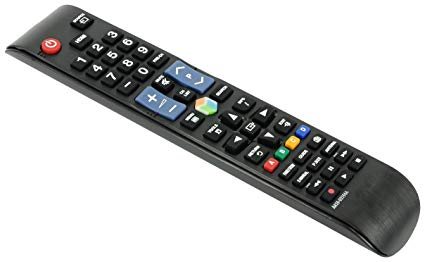
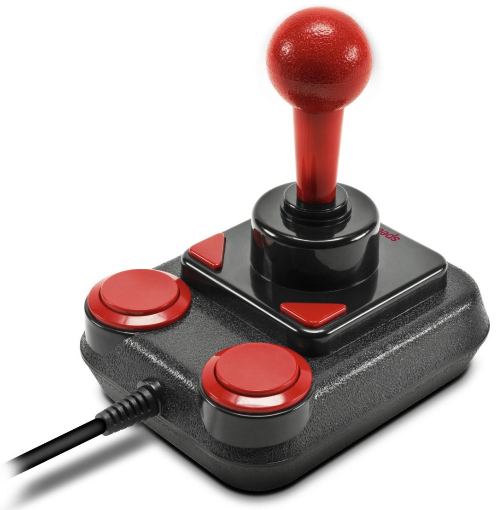

# spatial-navigation-artikel_CMDA-Minor-Web

Een concept wat heel interessant kan zijn voor op het internet is Spatial Navigation. Om Spatial Navigation uit te kunnen leggen is het voorbeeld van een televisie afstandsbediening erg geschikt. Op het moment dat iemand van kanaal wisselt en vervolgens het geluid hiervan wilt uitschakelen zit er qua hiërarchie een groot verschil tussen beide knoppen. Toch is het simpel om op kleine afstand een andere knop aan te klikken. Wanneer we dit naar het web vertalen zou je denken dat iedereen zijn muis gemakkelijk van links naar rechts kan bewegen. Echter zijn er ook mensen met beperkingen, die het misschien moeten doen met het gebruik van de Tab toets om zo door de pagina te navigeren. Dit ben ik verder gaan uitzoeken om zo een product op maat te kunnen creëren die voor de gebruiker een grote toevoeging kan zijn in zijn web ervaring.



Om dit te kunnen testen moet er naar diverse oplossingen gezocht worden. Als eerst moet er rekening gehouden worden met waar de focus op een bepaald element is. Vervolgens moet er nagedacht worden over hoe het mogelijk is dat je vanaf een bepaald element dat gefocust is, naar een volgende kan navigeren. Wanneer dit mogelijk is, moet er nagedacht worden over hoe de gebruiker dieper in een bepaald element kan navigeren. Dit is belangrijk als per er voor wilt zorgen dat de gebruiker grote delen kan overslaan die hij of zij niet direct wilt benaderen.

Het bekijken waar de focus op ligt binnen een pagina kan gedaan worden met:

```
document.activeElement.tagName
```

Uit dit element kan je ophalen wat bijvoorbeeld de classname Ivan het actieve element. Dit kan handig zijn om vervolgens een berekening te maken welk element er als volgt gefocust moet worden.

Tijdens het ontwikkelen van een structuur heb ik besloten om de benaming van de html elementen te gebruiken om te navigeren. Als iemand gefocust is op het element met de naam r1_c1, kon ik in html uitlezen dat het element op “Row” 1 in “Colom 1” was geselecteerd. Wanneer een element naast het huidige element geselecteerd moest worden, zou de naam van dit element r1_c2 kunnen zijn. In mijn ontwerp waar ik Spatial Navigation toepaste op het ontwerp van Spotify, heb ik 2 parents gebruikt.

Op het moment dat er een Arrow Key werd ingedrukt, werd er gekeken naar welke Arrow key dit was. Dit is belangrijk om te weten, zodat je weet in welke richting de huidige focus heen moet gaan. Dit gebeurt met behulp van eventListeners.

Nadat De gebruiker de focus heeft verplaats naar een nieuw element, moet het voor de gebruiker nog mogelijk zijn om naar een Child te kunnen navigeren. Hier heb ik de spatiebalk voor gebruikt. Hier is het ook weer belangrijk om goed over de benaming te denken, omdat de gebruiker van een Child in een element moet kunnen wisselen naar een Child van een andere Parent. Ik heb er voor gekozen om een Child aan te geven met de letter “K”, die benoemd is naar een Kid. De benaming zou als volgt zijn: r1_c1_k2.

Nu dit eenmaal is uitgewerkt hebben we een ontwerp gemaakt die met Spatial Navigation kan worden bestuurt. Dit ontwerp is gemaakt op het formaat op desktop, maar zou in de problemen komen zodra het op mobiel zou moeten werken. Ik heb nagedacht over hoe dit mogelijk gemaakt zou kunnen worden, en er zou anders omgegaan moeten worden met de benaming van alle elementen. Er zou met javascript berekend moeten worden waar de focus van jouw element is ten opzichte van de gehele pagina. Vervolgens zou de benaming met javascript zelf moeten worden ingevuld.

Als laatst punt heb ik dit ontwerp gemaakt voor iemand die een hevige vorm van spasme ondergaat. Doordat hij maar gebruik maakt van 1 arm, en in een bestuurbare rolstoel door het leven gaat, had ik besloten de navigatie te gebruiken die hij zelf ook al gebruikt, een Joystick. Met behulp van een Mapper heb ik de Joystick van [Speedlink](https://www.bol.com/nl/p/speedlink-anniversary-competition-pro-extra-usb-joystick-zwart-rood/9200000099736770/?suggestionType=typedsearch&bltgh=ldqyEKtYenkZ7YN-2wBH2Q.1.8.ProductTitle)
weten om te zetten naar de afstandsbediening voor mijn ontwerp. Hierdoor kwam het concept van Spatial Navigation goed uit de verf.


